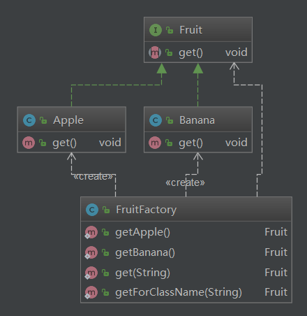

## 简单工厂模式

### 定义

简单工厂模式属于类的创建型模式,又叫做静态工厂方法模式。通过专门定义一个类来负责创建其他类的实例，被创建的实例通常都具有共同的父类。

### 角色及其职责

1. 工厂（Creator）角色

   简单工厂模式的核心，它负责实现创建所有实例的内部逻辑。工厂类可以被外界直接调用，创建所需的产品对象。

2. 抽象（Product）角色

   简单工厂模式所创建的所有对象的父类，它负责描述所有实例所共有的公共接口。

3. 具体产品（Concrete Product）角色

   简单工厂模式所创建的具体实例对象

### 优缺点

在这个模式中，工厂类是整个模式的关键所在。它包含必要的判断逻辑，能够根据外界给定的信息，决定究竟应该创建哪个具体类的对象。用户在使用时可以直接根据工厂类去创建所需的实例，而无需了解这些对象是如何创建以及如何组织的。有利于整个软件体系结构的优化。


不难发现，简单工厂模式的缺点也正体现在其工厂类上，由于工厂类集中了所有实例的创建逻辑，所以“高内聚”方面做的并不好。另外，当系统中的具体产品类不断增多时，可能会出现要求工厂类也要做相应的修改，扩展性并不很好。 


### 代码


```java
package com.darian.pattern_23.simpleFactory;

public interface Fruit {
    void get();
}

```


```java
package com.darian.pattern_23.simpleFactory;

public class Apple implements Fruit{
    @Override
    public void get() {
        System.out.println("get Apple");
    }
}

```


```java
package com.darian.pattern_23.simpleFactory;

public class Banana implements Fruit {
    @Override
    public void get() {
        System.out.println("get Bananna");
    }
}

```


```java
package com.darian.pattern_23.simpleFactory;


/***
 * 采集工厂
 */
public class FruitFactory {

    public static Fruit getApple() {
        return new Apple();
    }

    public static Fruit getBanana() {
        return new Banana();
    }

    public static Fruit get(String type) {
        if ("apple".equalsIgnoreCase(type)) {
            return getApple();
        } else if ("banana".equalsIgnoreCase(type)) {
            return getBanana();
        } else {
            throw new RuntimeException("没有找到对应的 Type");
        }

    }

    public static Fruit getForClassName(String className) {
        try {
            Class aClass = Class.forName(className);
            return (Fruit) aClass.getConstructor().newInstance();
        } catch (Exception e) {
            throw new RuntimeException("简单工厂构造失败:[" + className + "]", e);
        }

    }

}

```


```java
package com.darian.pattern_23.simpleFactory;

public class TestMain {
    public static void main(String[] args) {
        // ---- v1
        Fruit apple = FruitFactory.getApple();
        Fruit banana = FruitFactory.getBanana();
        apple.get();
        banana.get();

        // -- v2
        FruitFactory.get("apple").get();
        FruitFactory.get("banana").get();


        // -- v3
        FruitFactory.getForClassName(Apple.class.getName()).get();
        FruitFactory.getForClassName(Banana.class.getName()).get();

    }
}

```

### 架构




### 应用

- 连接池工厂链接
  - 链接工厂
    - mysql
    - oracle

