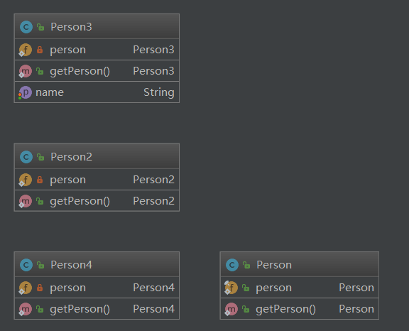

## 单例模式

### 定义

单例模式是一种对象创建型模式，使用单例模式，可以保证为一个类只生成唯一的实例对象。也就是说，在整个程序空间中，该类只存在一个实例对象。

​    其实，GoF对单例模式的定义是：保证一个类、只有一个实例存在，同时提供能对该实例加以访问的全局访问方法。 


### 场景

在应用系统开发中，我们常常有以下需求：

- 在多个线程之间，比如 servlet 环境，共享同一个资源或者操作同一个对象 

- 在整个程序空间使用全局变量，共享资源

- 大规模系统中，为了性能的考虑，需要节省对象的创建时间等等。

---

因为Singleton模式可以保证为一个类只生成唯一的实例

对象，所以这些情况，Singleton模式就派上用场了。


### 实现

1. 饿汉式。

2. 懒汉式。

3. 双重检查。


```java
package com.darian.pattern_23._05_singleton;

public class Person {
	public static final Person person = new Person();

	//构造函数私有化
	private Person() {
	}

	//提供一个全局的静态方法
	public static Person getPerson() {
		return person;
	}
}

```


```java
package com.darian.pattern_23._05_singleton;

public class Person2 {
	private static Person2 person;

	//构造函数私有化
	private Person2() {
	}

	//提供一个全局的静态方法
	public static Person2 getPerson() {
		if(person == null) {
			person = new Person2();
		}
		return person;
	}
}

```


```java
package com.darian.pattern_23._05_singleton;

public class Person3 {
	private String name;
	private static Person3 person;

	public String getName() {
		return name;
	}

	public void setName(String name) {
		this.name = name;
	}

	//构造函数私有化
	private Person3() {
	}

	//提供一个全局的静态方法，使用同步方法
	public static synchronized Person3 getPerson() {
		if(person == null) {
			person = new Person3();
		}
		return person;
	}
}

```


```java
package com.darian.pattern_23._05_singleton;

public class Person4 {
	private static Person4 person;

	//构造函数私有化
	private Person4() {
	}

	//提供一个全局的静态方法
	public static Person4 getPerson() {
		if(person == null) {
			synchronized (Person4.class) {
				if(person == null) {
					person = new Person4();
				}
			}
		}
		return person;
	}
}

```


### 架构图


