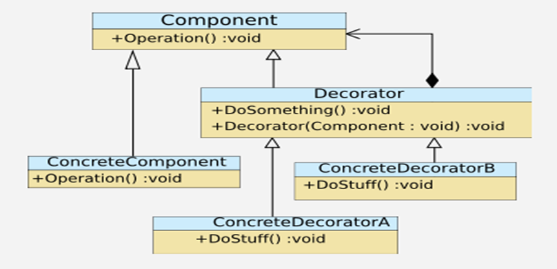
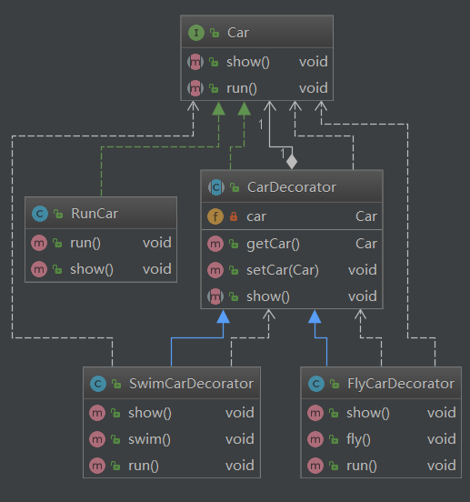

## 装饰器模式

### 定义

   装饰（ Decorator ）模式又叫做包装模式。通过一种对客户端透明的方式来扩展对象的功能，是继承关系的一个替换方案。

### 结构

### 角色和职责

- 抽象组件角色： 一个抽象接口，是被装饰类和装饰类的父接口。
- 具体组件角色：为抽象组件的实现类。
- 抽象装饰角色：包含一个组件的引用，并定义了与抽象组件一致的接口。
- 具体装饰角色：为抽象装饰角色的实现类。负责具体的装饰。

### 场景：

读取文件的 `fileReader`
