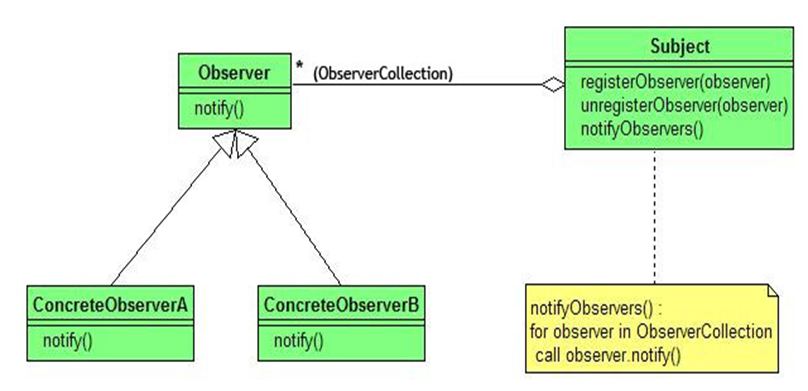
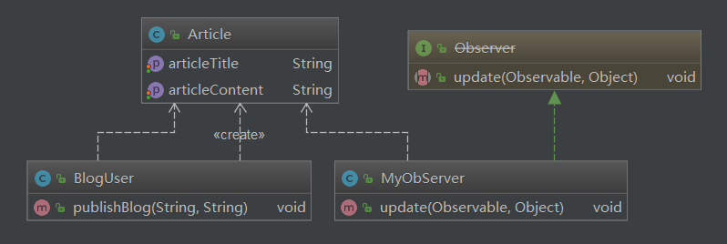

## 观察者模式

### 定义：

​	Observer模式是行为模式之一，它的作用是当一个对象的状态发生变化时，能够自动通知其他关联对象，自动刷新对象状态。

​	Observer模式提供给关联对象一种同步通信的手段，使某个对象与依赖它的其他对象之间保持状态同步。

### 结构




### 角色和职责

- Subject（被观察者）     被观察的对象。当需要被观察的状态发生变化时，需要通知队列中所有观察者对象。Subject需要维持（添加，删除，通知）一个观察者对象的队列列表。
- ConcreteSubject     被观察者的具体实现。包含一些基本的属性状态及其他操作。 
- Observer（观察者）     接口或抽象类。当Subject的状态发生变化时，Observer对象将通过一个callback函数得到通知。
- ConcreteObserver     观察者的具体实现。得到通知后将完成一些具体的业务逻辑处理。

### 典型应用

- 侦听事件驱动程序设计中的外部事件

- 侦听/监视某个对象的状态变化

- 发布者/订阅者(publisher/subscriber)模型中，当一个外部事件（新的产品，消息的出现等等）被触发时，通知邮件列表中的订阅者


### 架构图

#### 1 




#### 2 


### 代码

```java
package com.darian.pattern_23._10_observer;

import java.util.Observable;
import java.util.Observer;

public class MyObServer implements Observer {

	@Override
	public void update(Observable o, Object arg) {
		System.out.println( o + " update: " + arg);
	}
}

```


```java
package com.darian.pattern_23._10_observer;

import java.util.Observable;

public class Person extends Observable {
	private String name;
	private String sex;
	private int age;

	public String getName() {
		return name;
	}

	public void setName(String name) {
		this.name = name;
		this.setChanged();
		this.notifyObservers("setName:" + name);
	}

	public String getSex() {
		return sex;
	}

	public void setSex(String sex) {
		this.sex = sex;
		this.setChanged();
		this.notifyObservers("setSex:" + sex);
	}

	public int getAge() {
		return age;
	}

	public void setAge(int age) {
		this.age = age;
		this.setChanged();
		this.notifyObservers("setAge:" + age);
	}

}

```


```java
package com.darian.pattern_23._10_observer;

public class MainClass {
	public static void main(String[] args) {
		Person person = new Person();
		person.addObserver(new MyObServer());
		person.addObserver(new MyObServer());
		System.out.println("person.countObservers():"+person.countObservers());

		person.setName("lifengxing");
		person.setAge(23);
		person.setSex("男");
	}
}

```


```java
person.countObservers():2
com.darian.pattern_23._10_observer.Person@77f03bb1 update: setName:lifengxing
com.darian.pattern_23._10_observer.Person@77f03bb1 update: setName:lifengxing
com.darian.pattern_23._10_observer.Person@77f03bb1 update: setAge:23
com.darian.pattern_23._10_observer.Person@77f03bb1 update: setAge:23
com.darian.pattern_23._10_observer.Person@77f03bb1 update: setSex:男
com.darian.pattern_23._10_observer.Person@77f03bb1 update: setSex:男
```


### 重点

`#setChanged` 


