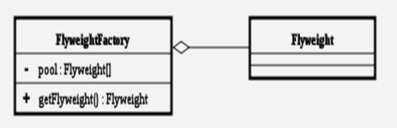
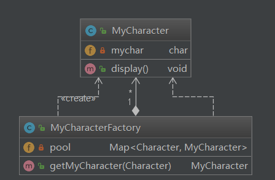
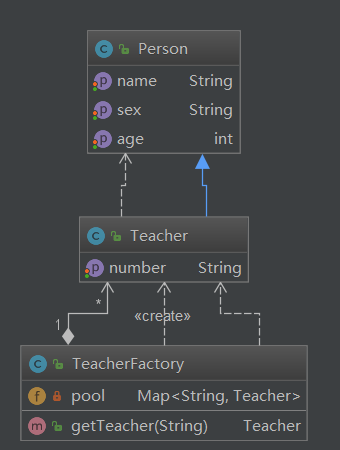

## 享元模式

### 定义

   Flyweight模式也叫享元模式，是构造型模式之一，它通过与其他类似对象共享数据来减小内存占用。

### 结构

### 角色和职责

- 抽象享元角色

  所有具体享元类的父类，规定一些需要实现的公共接口。 

- 具体享元角色：

  抽象享元角色的具体实现类，并实现了抽象享元角色规定的方法。 

- 享元工厂角色：

  负责创建和管理享元角色。

### 架构图

#### 1

#### 2

