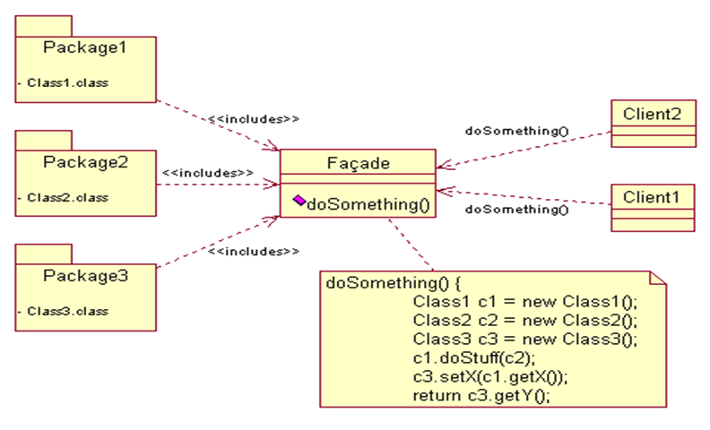
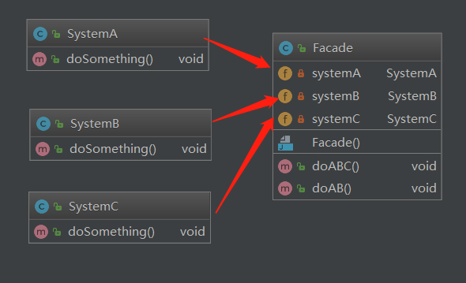
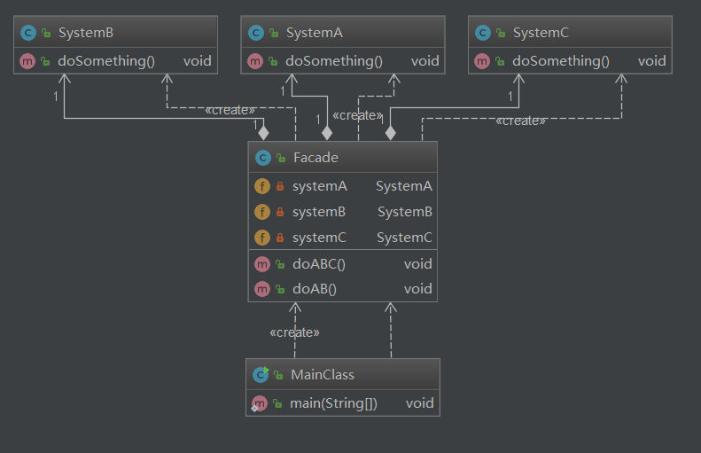
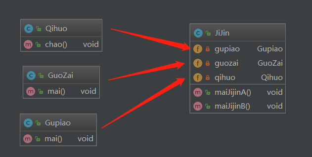
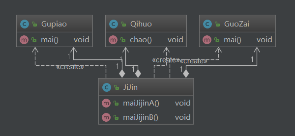

## 门面模式（外观模式）

### 定义

   Facade模式也叫外观模式，是由GoF提出的23种设计模式中的一种。Facade模式为一组具有类似功能的类群，比如类库，子系统等等，提供一个一致的简单的界面。这个一致的简单的界面被称作facade。

### 结构：

### 角色和职责

- Facade     为调用方定义简单的调用接口。
- Clients     调用者。通过Facade接口调用提供某功能的内部类群。
- Packages     功能提供者。指提供功能的类群（模块或子系统）。

 

###  架构图

