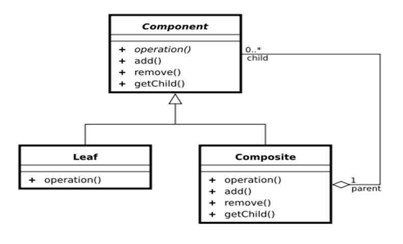
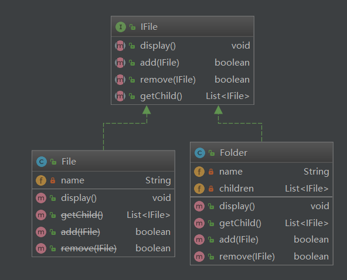
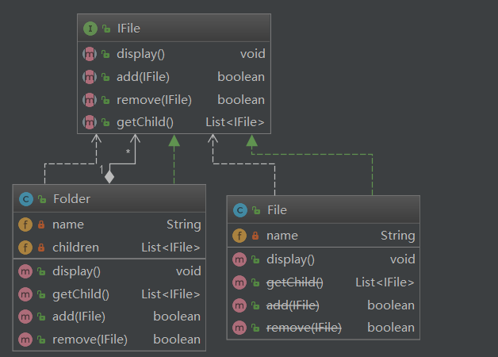

## 组合模式

### 定义

​    Composite模式也叫组合模式，是构造型的设计模式之一。通过递归手段来构造树形的对象结构，并可以通过一个对象来访问整个对象树。


### 结构




### 角色和职责

- Component （树形结构的节点抽象）
  - 为所有的对象定义统一的接口（公共属性，行为等的定义）
  - 提供管理子节点对象的接口方法
  - [可选]提供管理父节点对象的接口方法

- Leaf （树形结构的叶节点）
  - Component的实现子类

- Composite（树形结构的枝节点）
  - Component的实现子类


### 架构图








### 代码


```java
package com.darian.pattern_23._14_composite;

import java.util.List;

/*
 * 文件节点抽象(是文件和目录的父类)
 */
public interface IFile {

    //显示文件或者文件夹的名称
    void display();

    //添加
    boolean add(IFile file);

    //移除
    boolean remove(IFile file);

    //获得子节点
    List<IFile> getChild();
}


```


```java
package com.darian.pattern_23._14_composite;

import java.util.List;

/**
 * 文件的抽象
 **/
public class File implements IFile {
	private String name;
	
	public File(String name) {
		this.name = name;
	}

	public void display() {
		System.out.println(name);
	}

	@Deprecated
	public List<IFile> getChild() {
		return null;
	}

	@Deprecated
	public boolean add(IFile file) {
		return false;
	}

	@Deprecated
	public boolean remove(IFile file) {
		return false;
	}

}

```


```java
package com.darian.pattern_23._14_composite;

import java.util.ArrayList;
import java.util.List;

/***
 * 文件夹的抽象
 */
public class Folder implements IFile{
	private String name;
	private List<IFile> children;
	
	public Folder(String name) {
		this.name = name;
		children = new ArrayList<>();
	}
	

	public void display() {
		System.out.println(name);
	}

	public List<IFile> getChild() {
		return children;
	}


	public boolean add(IFile file) {
		return children.add(file);
	}


	public boolean remove(IFile file) {
		return children.remove(file);
	}


}

```


```java
package com.darian.pattern_23._14_composite;

import java.util.List;


public class MainClass {
	public static void main(String[] args) {
		//C盘
		Folder rootFolder = new Folder("C:");
		// darianOne 目录
		Folder darianOneFolder = new Folder("darianOne");
		// darianOne.txt文件
		File darianOneFile = new File("darianOne.txt");

		rootFolder.add(darianOneFile);
		rootFolder.add(darianOneFolder);


		// darianOne 目录
		Folder darianTwoFolder = new Folder("darianTwo");
		File darianTwoFile = new File("darianTwo.txt");
		darianOneFolder.add(darianTwoFile);
		darianOneFolder.add(darianTwoFolder);


		Folder darianThreeFolder = new Folder("darianThree");
		File darianThreeFile = new File("darianThree.txt");
		darianTwoFolder.add(darianThreeFile);
		darianTwoFolder.add(darianThreeFolder);


		displayTree(rootFolder,0);

	}

	public static void displayTree(IFile rootFolder, int deep) {
		for(int i = 0; i < deep; i++) {
			System.out.print("   ");
		}

		System.out.print("|--");
		//显示自身的名称
		rootFolder.display();
		//获得子树
		List<IFile> children = rootFolder.getChild();
		//遍历子树
		for(IFile file : children) {
			if(file instanceof File) {
				for(int i = 0; i <= deep; i++) {
					System.out.print("   ");
				}
				System.out.print("|--");
				file.display();
			} else {
				displayTree(file,deep + 1);
			}
		}
	}
}

```


```c
|--C:
   |--darianOne.txt
   |--darianOne
      |--darianTwo.txt
      |--darianTwo
         |--darianThree.txt
         |--darianThree
```


#### 思路

- 父接口
- 叶子节点
- 枝节点（枝节点具有叶子节点不具备的特性），添加节点，等等。


便利时，传递当前枝节点的深度，进行 格式的缩进


