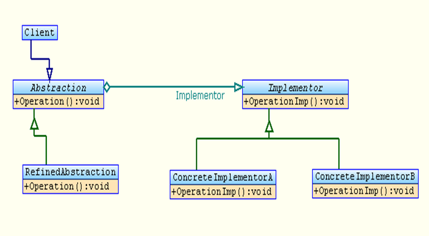
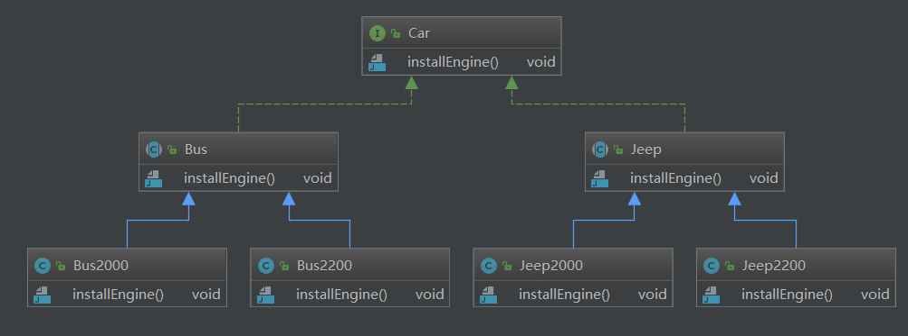
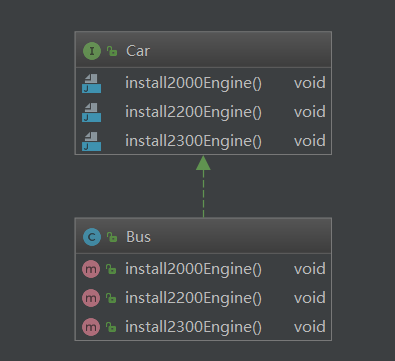
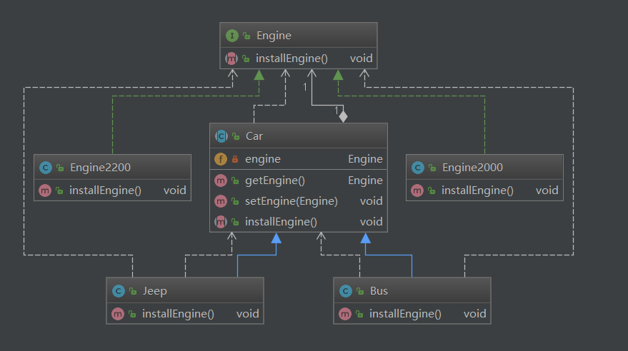

## 桥接模式

### 介绍

​     Bridge 模式又叫做桥接模式，是构造型的设计模式之一。Bridge模式基于类的最小设计原则，通过使用封装，聚合以及继承等行为来让不同的类承担不同的责任。它的主要特点是把抽象（abstraction）与行为实现（implementation）分离开来，从而可以保持各部分的独立性以及应对它们的功能扩展。


###  架构图




###  角色和职责

- Client

  - Bridge模式的使用者

- Abstraction

  - 抽象类接口（接口或抽象类**）**

  0 维护对行为实现（Implementor）的引用

- Refined Abstraction

  - Abstraction子类

- Implementor

  - 行为实现类接口 (Abstraction接口定义了基于Implementor接口的更高层次的操作)

- ConcreteImplementor

  - Implementor子类

 

### 架构衍进过程：

#### 1. 



类关系不好把握。

#### 2.



#### 3. 





### 代码；


```java
package com.darian.pattern_23._15_Bridge.eg3;

public interface Engine {
	void installEngine();
}

```


```java
package com.darian.pattern_23._15_Bridge.eg3;

public class Engine2000 implements Engine {

	public void installEngine() {
		System.out.println("Engine2000...installEngine.......");
	}

}

```


```java
package com.darian.pattern_23._15_Bridge.eg3;

public class Engine2200 implements Engine{

	public void installEngine() {
		System.out.println("Engine2200...installEngine.......");
	}

}

```


```java
package com.darian.pattern_23._15_Bridge.eg3;

public abstract class Car {
	private Engine engine;
	
	public Car(Engine engine) {
		this.engine = engine;
	}
	
	public Engine getEngine() {
		return engine;
	}

	public void setEngine(Engine engine) {
		this.engine = engine;
	}

	public abstract void installEngine();
}

```


```java
package com.darian.pattern_23._15_Bridge.eg3;

public class Bus extends Car{

	public Bus(Engine engine) {
		super(engine);
	}

	public void installEngine() {
		System.out.print("Bus......installEngine......");
		this.getEngine().installEngine();
	}
}

```


```java
package com.darian.pattern_23._15_Bridge.eg3;

public class Jeep extends Car {

	public Jeep(Engine engine) {
		super(engine);
	}

	public void installEngine() {
		System.out.print("Jeep....installEngine......");
		this.getEngine().installEngine();
	}

}

```


```java
package com.darian.pattern_23._15_Bridge.eg3;

public class MainClass {
	public static void main(String[] args) {
		
		Engine engine2000 = new Engine2000();
		Engine engine2200 = new Engine2200();
		
		Car car1 = new Bus(engine2000);
		car1.installEngine();
		
		Car car2 = new Bus(engine2200);
		car2.installEngine();
		
		Car jeep1 = new Jeep(engine2000);
		jeep1.installEngine();
		
		Car jeep2 = new Jeep(engine2200);
		jeep2.installEngine();
		
	}
}

```


```c
Bus......installEngine......Engine2000...installEngine.......
Bus......installEngine......Engine2200...installEngine.......
Jeep....installEngine......Engine2000...installEngine.......
Jeep....installEngine......Engine2200...installEngine.......
```


### 例子

- 给人接不同的骨头，
- 手机换不同容量的电池。


