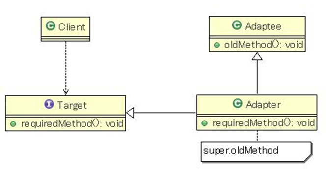
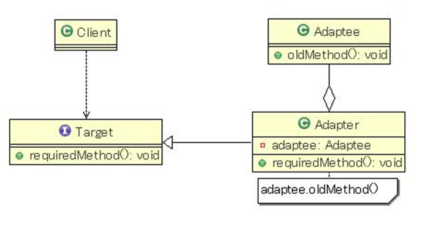
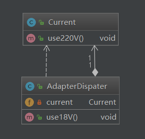

## 适配器模式

### 介绍

Adapter模式也叫适配器模式，是构造型模式之一，通过Adapter模式可以改变已有类（或外部类）的接口形式。

### 应用场景

   在大规模的系统开发过程中，我们常常碰到诸如以下这些情况：我们需要实现某些功能，这些功能已有还不太成熟的一个或多个外部组件，如果我们自己重新开发这些功能会花费大量时间；所以很多情况下会选择先暂时使用外部组件，以后再考虑随时替换。但这样一来，会带来一个问题，随着对外部组件库的替换，可能需要对引用该外部组件的源代码进行大面积的修改，因此也极可能引入新的问题等等。如何最大限度的降低修改面呢？

Adapter模式就是针对这种类似需求而提出来的。

Adapter模式通过定义一个新的接口（对要实现的功能加以抽象），和一个实现该接口的Adapter（适配器）类来透明地调用外部组件。这样替换外部组件时，最多只要修改几个Adapter类就可以了，其他源代码都不会受到影响。

###  结构

#### 继承结构

- 通过继承实现Adapter
  


#### 委派结构

- 通过委派实现Adapter

   


### 架构图：

#### 继承：


#### 委派




```java
package com.darian.pattern_23._16_Adapter;

public class Current {
	
	public void use220V() {
		System.out.println("Current....use220V......");
	}
}

```


```java
package com.darian.pattern_23._16_Adapter;

public class AdapterExtends extends Current {
    public void use18V() {
        System.out.println("AdapterExtends...use18V...");
        this.use220V();
    }
}

```


```java
package com.darian.pattern_23._16_Adapter;

public class AdapterDispater {
	private Current current;
	
	public AdapterDispater(Current current) {
		this.current = current;
	}
	
	public void use18V() {
		System.out.println("AdapterDispater....use18V......");
		this.current.use220V();
	}
}

```


```java
package com.darian.pattern_23._16_Adapter;

public class MainClass {
	public static void main(String[] args) {
//		Current current = new Current();
//		current.use220V();

		AdapterExtends adapterExtends = new AdapterExtends();
		adapterExtends.use18V();
		
		AdapterDispater adapter = new AdapterDispater(new Current());
		adapter.use18V();
	}
}

```


### 建议：委派

多用委派，不用继承，继承父子类关系，关联性较强。
