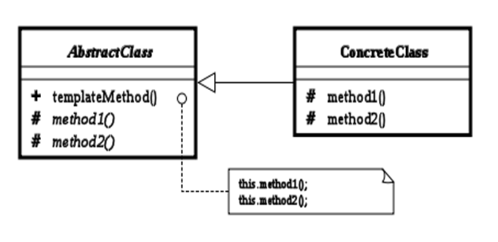
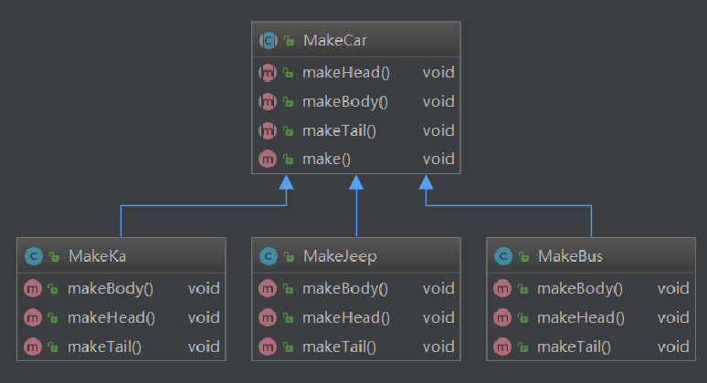

## 模板方法模式

### 介绍

   Template Method模式也叫模板方法模式，是行为模式之一，它把具有特定步骤算法中的某些必要的处理委让给抽象方法，通过子类继承对抽象方法的不同实现改变整个算法的行为。

### 应用场景

Template Method模式一般应用在具有以下条件的应用中：

- 具有统一的操作步骤或操作过程

- 具有不同的操作细节

- 存在多个具有同样操作步骤的应用场景，但某些具体的操作细节却各不相同

### 结构

### 角色和职责

- `AbstractClass`：抽象类的父类

- `ConcreteClass`：具体的实现子类
- `#templateMethod()`：模板方法
- `#method1()`与 `#method2()` ： 具体步骤方法  

### 架构图

