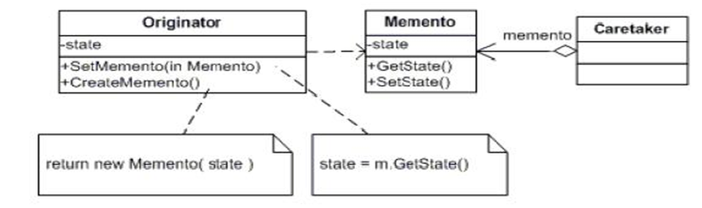
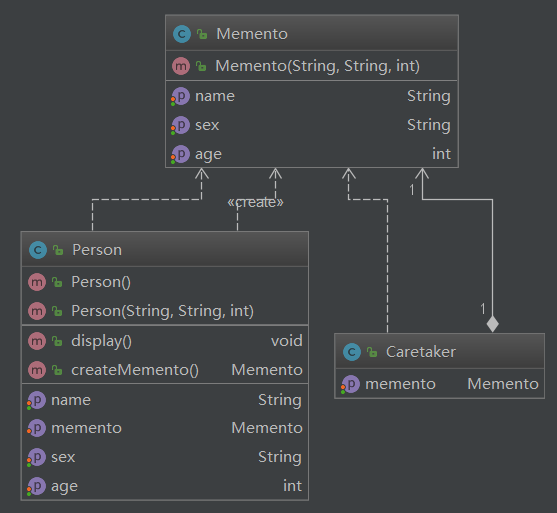

## 备忘录模式

### 介绍

   Memento模式也叫备忘录模式，是行为模式之一，它的作用是保存对象的内部状态，并在需要的时候（undo/rollback）恢复对象以前的状态。

### 应用场景

如果一个对象需要保存状态并可通过undo或rollback等操作恢复到以前的状态时，可以使用Memento模式。

1. 一个类需要保存它的对象的状态（相当于Originator角色）
2. 设计一个类，该类只是用来保存上述对象的状态（相当于Memento角色）
3. 需要的时候，Caretaker角色要求Originator返回一个Memento并加以保存
4. undo或rollback操作时，通过Caretaker保存的Memento恢复Originator对象的状态

### 结构

### 角色和职责

- `Originator`（原生者）
  - 需要被保存状态以便恢复的那个对象。
- `Memento`（备忘录）​    
  - 该对象由Originator创建，主要用来保存Originator的内部状态。
- `Caretaker`（管理者）
  - 负责在适当的时间保存/恢复Originator对象的状态。

### 架构图

### 场景：

打游戏的场景，闯关，记注
