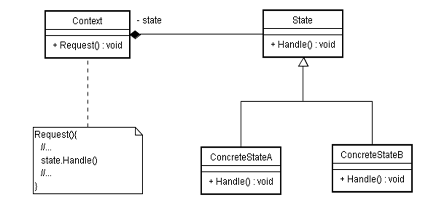
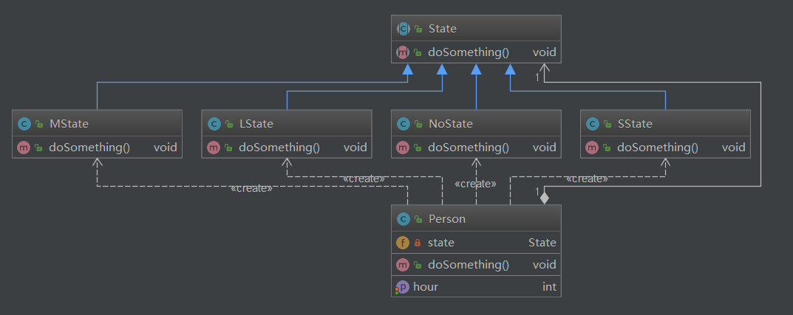
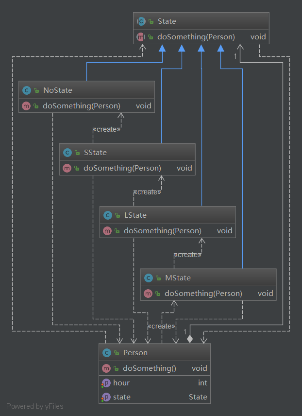

## 状态模式

### 简介

   State模式也叫状态模式，是行为设计模式的一种。State模式允许通过改变对象的内部状态而改变对象的行为，这个对象表现得就好像修改了它的类一样。 

### 应用场景

  状态模式主要解决的是当控制一个对象状态转换的条件表达式过于复杂时的情况。把状态的判断逻辑转译到表现不同状态的一系列类当中，可以把复杂的判断逻辑简化。

### 结构

### 角色和职责

- `Context`：`用户对象`   拥有一个State类型的成员，以标识对象的当前状态； 

- `State`：`接口或基类` 封装与Context的特定状态相关的行为； 
- `ConcreteState`：`接口实现类或子类`   实现了一个与Context某个状态相关的行为。 

### 架构图

#### ex2

#### ext3

