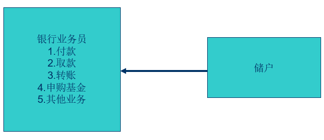
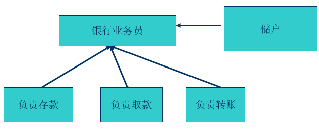
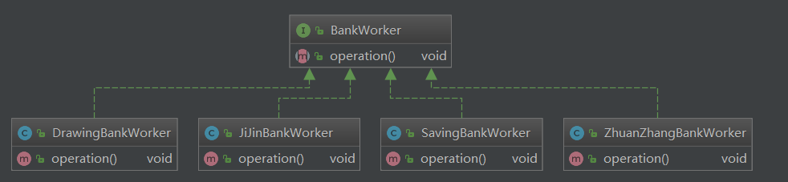

## 基础一开放封闭原则

### 定义

   开放封闭原则(Open-Closed Principle)：一个软件实体应当对扩展开放，则修改关闭。

   在设计一个模块时，应当使得这个模块可以在不被修改的前提下被扩展。也就是说，应当可以在不必修改源代码的情况下修改这个模块的行为。

   设计的目的便在于面对需求的改变而保持系统的相对稳定，从而使得系统可以很容易的从一个版本升级到另一个版本。

### 怎样做到开放封闭原则

​     实际上，绝对封闭的系统是不存在的。无论模块是怎么封闭，到最后，总还是有一些无法封闭的变化。而我们的思路就是：既然不能做到完全封闭，那我们就应该对那些变化封闭，那些变化隔离做出选择。我们做出选择，然后将那些无法封闭的变化抽象出来，进行隔离，允许扩展，尽可能的减少系统的开发。当系统变化来临时，我们要及时的做出反应。

​      我们并不害怕改变的到来。当变化到来时，我们首先需要做的不是修改代码，而是尽可能的将变化抽象出来进行隔离，然后进行扩展。面对需求的变化，对程序的修改应该是尽可能通过添加代码来实现，而不是通过修改代码来实现。

​      实际上，变化或者可能的变化来的越早，抽象就越容易，相对的，代码的维护也就越容易；而当项目接近于完成而来的需求变化，则会使抽象变得很困难——这个困难，并不是抽象本身的困难，抽象本身并没有困难，困难在于系统的架构已经完成，修改牵扯的方面太多而使得抽象工作变得很困难。

#### 银行业务员

##### 繁忙的

##### 轻松的

### 开放封闭原则的优越性

1. 通过扩展已有的软件系统，可以提供新的行为，以满足对软件的新需求，是变化中的软件有一定的适应性和灵活性。
2. 已有的软件模块，特别是最重要的抽象模块不能再修改，这就使变化中的软件系统有一定的稳定性和延续性。

### 架构图

