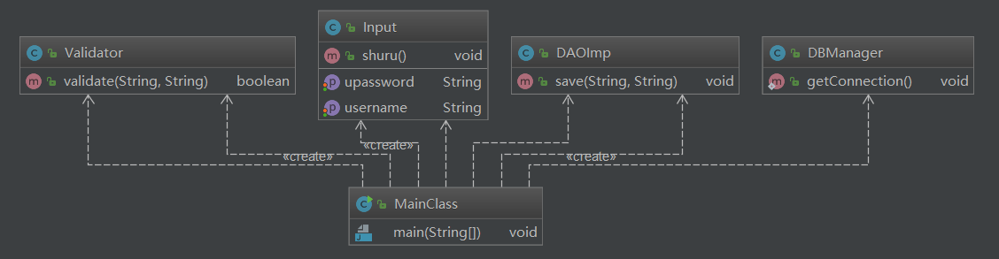

## 单一职责原则

### 定义

单一职责原则(Single Responsibility Principle )：

​       就一个类而言，应该仅有一个引起它变化的原因。

### 多功能的山寨手机

山寨手机的功能：

​       拍照、摄像、手机游戏、网络摄像头、GPS、炒股等等。

功能多、但是每一个功能都不强。

- 拍摄功能 -----》》专业摄像机或照相机
- 手机游戏 ------》》PSP
- 网络摄像头----》》专业摄像头
- GPS功能------》》专业GPS导航系统

#### 烦人的山寨手机

​    每一个职责都是一个变化的轴线，当需求变化时会反映为类的职责的变化。如果一个类承担的职责多于一个，那么引起它变化的原因就有多个。一个职责的变化甚至可能会削弱或者抑制类完成其他职责的能力，从而导致脆弱的设计。

### 单一职责原则示例

接受客户端输入并提交到数据库。

#### 原有设计：

​    一个类负责接受客户端输入，对客户端输入进行校验，连接数据库，并提交数据到数据库。

#### 现有设计：

​    一个功能也就是一个职责由一个类来负责。

### 架构图

