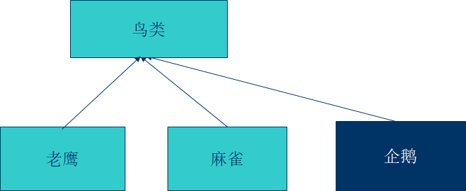
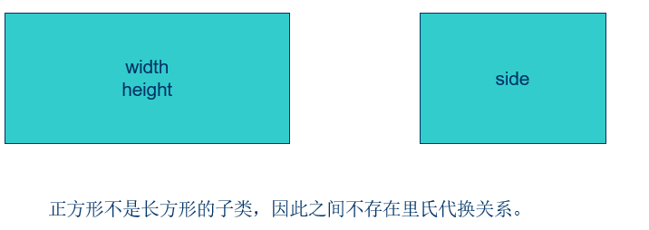
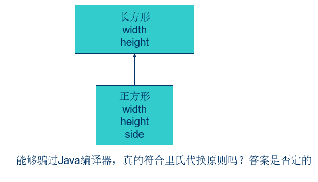
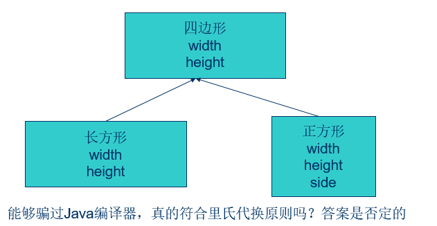
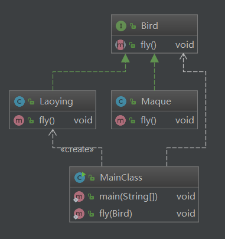

## 里氏代换原则

### 介绍

里氏代换原则(Liskov Substitution Principle)：

​    一个软件实体如果使用的是一个父类的话，那么一定适用于其子类，而且它察觉不出父类和子类对象的区别。也就是说，在软件里面，把父类替换成它的子类，程序的行为没有变化。

### 反过来的代换不成立

里氏代换原则(Liskov Substitution Principle)：

​    一个软件实体如果使用的是一个子类的话，那么它不能适用于其父类。

#### 企鹅是鸟类吗？？

#### 正方形是一种长方形吗？？

##### 好骗的Java编译器

##### 原来还有一个四边形的概念？

### 架构图

