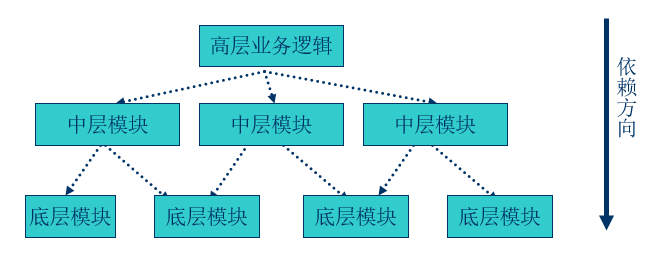
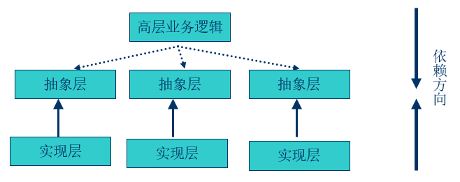
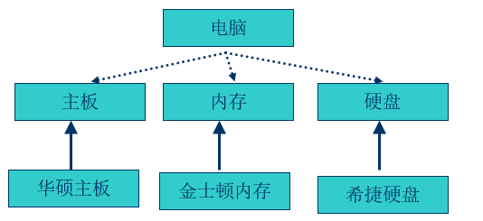
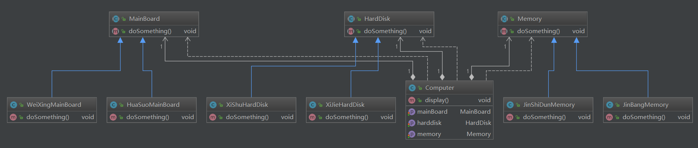

## 依赖倒转原则

### 什么是倒转？

传统的过程式设计倾向于使高层次的模块依赖于低层次的模块，抽象层依赖于具体的层次。

### 什么是依赖倒转原则

依赖倒转(Dependence Inversion Principle )：

1. 抽象不应该依赖于细节，细节应该依赖于抽象。

​    2. 高层模块不依赖底层模块，两者都依赖抽象。

#### 组装电脑

### 怎样做到依赖倒转？

1. 工厂方法模式

2. 模板方法模式

3. 迭代子模式 

### 架构图

