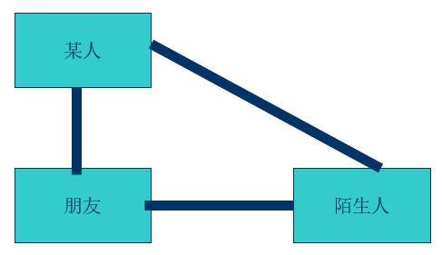
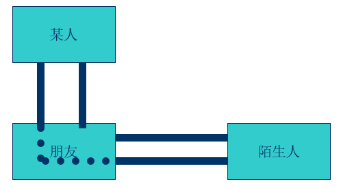
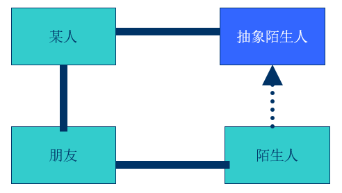
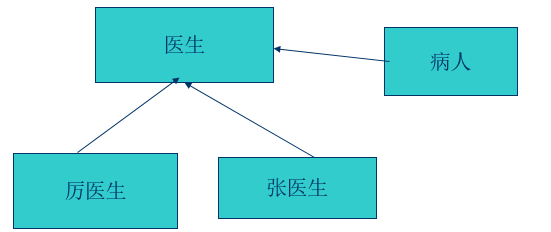
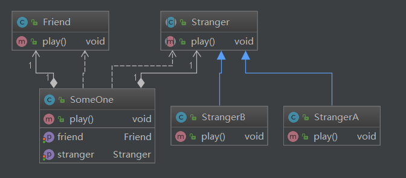

## 迪米特法则

### 定义

   迪米特法则(Law of Demeter )又叫做最少知识原则，也就是说，一个对象应当对其他对象尽可能少的了解。

​    迪米特法则最初是用来作为面向对象的系统设计风格的一种法则，于1987年秋天由lan holland在美国东北大学为一个叫做迪米特的项目设计提出的。

#### 狭义的迪米特法则

   如果两个类不必彼此直接通信，那么这两个类就不应当发生直接的相互作用。如果其中一个类需要调用另一类的某一个方法的话，可以通过第三者转发这个调用。

#### 和陌生人说话

##### 不要和陌生人说话

### 与依赖倒转原则结合

### 走后门看病

### 办理手续住院

### 迪米特法则和设计模式

1. 外观模式

2. 中介者模式

### 架构图

