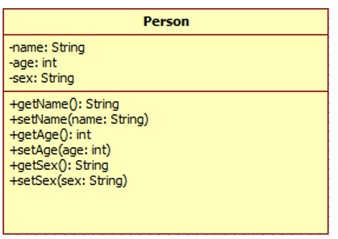
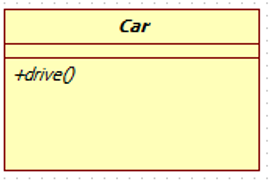
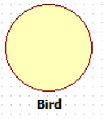
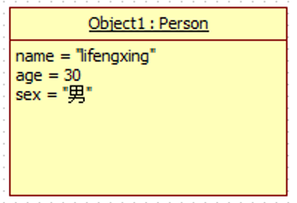
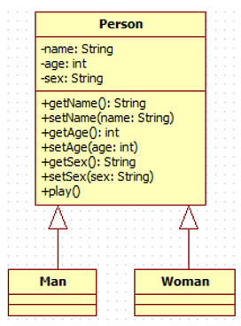
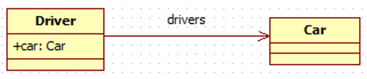
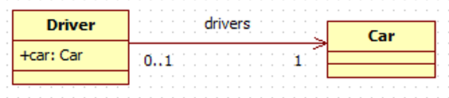
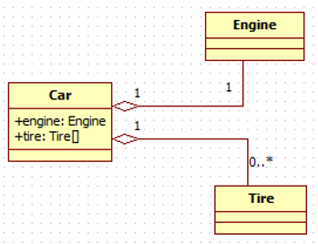
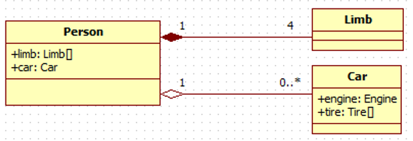
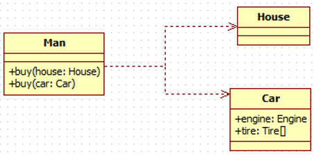

### 描述类的类图

### 抽象类 

### 接口

### 对象

### 一般化关系（继承）

### 关联关系

### 关联基数

### 聚合关系

聚合关系是关联关系的一种，表示的是整体和个体之间的关系。

### 合成关系

合成关系是关联关系的一种，比聚合关系更强，它要求普通的聚合关系中代表整体的对象负责代表部分的对象的生命周期，合成关系不能共享。

### 依赖关系

依赖也是类与类之间的连接，依赖总是单向的。依赖关系表示一个类依赖于另一个类的定义。

