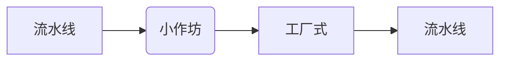

# 设计模式：

> 怎么做人？
>
> 中国来说：
>
> * 出生 、二十加冕、三十而立、四十不惑、五十知天命、六十花甲...

## 经验之谈：

> 总结前人的经验，提供给后人去借鉴使用

​	 **前人栽树，后人乘凉**

## 用途

>  	解决一些具有代表性的一些问题。
>
> ​	设计模式，通常来源于生活，反过来帮助我们更好的生活

设计模式

​	 **提升代码的可读性、可扩展性、维护成本、复杂的业务问题**

## 忠告

>  	千万不要**死记硬背**

每个**设计模式**都会结合一个生活案例去讲解， **穷举法**。

# 历史

- **集体生活**
- **小作坊** `提升产品的质量，提高生产的效率`
- **工厂式** `大规模的标准化的批量生产`
- **流水线** `一条流水线值生产一个产品。A-某个零件；B-某个零件`

> **解决了用户与产品之间的问题**


### 工厂模式发展史图片：



### 简单工厂模式：

* **BeanFacotry** (BeanDefinetion)
  * 生产 **Bean**
    * `< Bean Scope = "single" >`
    * `< Bean Scope = "prototype" >`

#### 实现了：

>  	ISO标准，GB标准


> 工厂的分工越来越细


## 抽象工厂模式：

抽象类定义抽象方法，

实现类去实现。


# 代码


### 基础代码：

##### `Milk`.class

```java
public interface Milk {

    /**
     * 获取一个标准产品
     * <br>Darian
     **/
    public String getName();
}
```

##### `MengNiu`.class

```java
@Data
public class MengNiu implements Milk {

    private String name = "MengNiu";

    @Override
    public String getName() {
        return name;
    }
}
```

##### `SanLu`.class

```java
@Data
public class SanLu implements Milk {

    private String name = "SanLu";
    
    @Override
    public String getName() {
        return name;
    }
}
```

##### `TeLunSu`.class

```java
@Data
public class TeLunSu implements Milk {

    private String name = "TeLunSu";

    @Override
    public String getName() {
        return name;
    }
}
```

##### `YiLi`.class

```java
@Data
public class YiLi implements Milk {

    private String name = "YiLi";
    
    @Override
    public String getName() {
        return name;
    }
}
```

### 小作坊式工厂模式：

##### `SimpleFactory` .class

```java
public class SimpleFactory {
    public Milk getMilk(String name) {
        if ("TeLunSu".equals(name)) {
            return new TeLunSu();
        } else if ("YiLi".equals(name)) {
            return new YiLi();
        } else if ("MengNiu".equals(name)) {
            return new MengNiu();
        }
        System.out.println("不能生产您所需的产品");
        return null;
    }
}
```

##### `SimpleFactoryTest`.class

```java
public class SimpleFactoryTest {

    public static void main(String[] args) {

        // 这个 new 的过程实际上是一个比较复杂的过程
        // 有人民币就不需要自己 new 了
        // System.out.println(new TeLunSu().getName());

        // 小作坊式的生产模式
        // 用户不再关心生产的过程，而只需要关心这个结果

        // 假如：特仑苏、伊利、蒙牛
        // 成分配都是不一样的
        SimpleFactory simpleFactory = new SimpleFactory();
        System.out.println(simpleFactory.getMilk("TeLunSu"));
        System.out.println(simpleFactory.getMilk("YiLi"));
        System.out.println(simpleFactory.getMilk("MengNiu"));
    }
}
```

### 简单工厂模式

##### `Facotry`.class

```java
/**
 * 工厂模型
 * <br>Darian
 **/
public interface Facotry {

    /**
     * 工厂必然具有生产产品技能，统一的产品出口
     **/
    Milk getMilk();
}
```

##### `MengNiuFacotry`.class

```java
public class MengNiuFacotry implements Facotry {
    @Override
    public Milk getMilk() {
        return new MengNiu();
    }
}
```

##### `TeLunSuFacotry`.class

```java
public class TeLunSuFacotry implements Facotry {
    @Override
    public Milk getMilk() {
        return new TeLunSu();
    }
}
```

##### `YiLiFactory`.class

```java
public class YiLiFactory implements Facotry {
    @Override
    public Milk getMilk() {
        return new YiLi();
    }
}
```

##### `FactoryTest`.class

```java
public class FactoryTest {
    public static void main(String[] args) {
        // 货比三家，
        // 不知道谁好谁坏
        // 配置，可能会配置错
        MengNiuFacotry mengNiuFacotry = new MengNiuFacotry();
        System.out.println(mengNiuFacotry.getMilk());
        YiLiFactory yiLiFactory = new YiLiFactory();
        System.out.println(yiLiFactory.getMilk());
        TeLunSuFacotry teLunSuFacotry = new TeLunSuFacotry();
        System.out.println(teLunSuFacotry.getMilk());
    }
}
```

### 抽象工厂模式

##### `AbstractFactory`.class

```java
/**
 * 抽象工厂是用户的主入口
 * 在 Spring 种应用得最为广泛的一种设计模式
 * 易于拓展
 * <br>Darian
 **/
public abstract class AbstractFactory {

    // 公共的逻辑
    // 方便于统一的管理

    /**
     * 获得一个 MengNiu
     **/
    public abstract Milk getMengNiu();
    /**
     * 获得一个 YiLi
     **/
    public abstract Milk getYiLi();
    /**
     * 获得一个 TeLunSu
     **/
    public abstract Milk getTeLunSu();

    public abstract Milk getSanLu();
}
```

##### `MilkFactory`.class

```java
public class MilkFactory extends AbstractFactory {

    @Override
    public Milk getMengNiu() {
        return new MengNiuFacotry().getMilk();
    }

    @Override
    public Milk getYiLi() {
        return new YiLiFactory().getMilk();
    }

    @Override
    public Milk getTeLunSu() {
        return new TeLunSuFacotry().getMilk();
    }

    @Override
    public Milk getSanLu() {
        return new SanLu();
    }
}
```

##### `AbstractFactoryTest`.class

```java
public class AbstractFactoryTest {

    public static void main(String[] args) {
        MilkFactory milkFactory = new MilkFactory();
        /**
         * 对于用户而言，更加简单明了
         * 用户只有选择的权力了，保证了程序的健壮性
         **/
        System.out.println(milkFactory.getMengNiu());
        System.out.println(milkFactory.getYiLi());
    }
}
```

