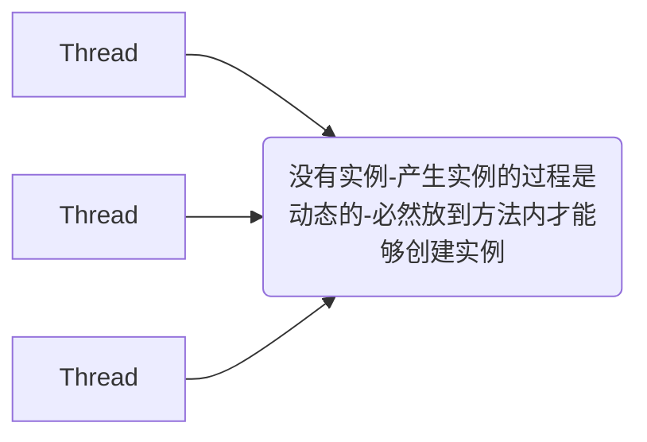

# 单例模式

全局只有唯一一个实例，

> ​	 **一个类模板，在整个系统运行中，只允许产生一个实例（有且只有一个实例（有且只有一个）**
>
> ​	new 
>
> ​	分布式系统中用 `分布式锁` 来保证单例模式。


## 例子：

* **工厂本身**
* **配置文件**
* **日历**

## 保证单例模式的技术方案

> ​	解决一个并发访问时的时候的线程安全问题。

* **饿汉式**
* **懒汉式**
* **注册等级式**
* **枚举式**
* **序列化于反序列化时会出现多例**

### 饿汉式：

> ​	 **在实例使用之前，不管你用不用，我都先 new 出来再说，避免了线程安全问题**

### 饿汉式：

> ​	 **默认加载的时候不是梨花，在需要用到这个实例的时候才实例化。`延时加载`**

### 注册登记式：

> ​	 **每使用一次，都往固定的容器中去注册，并且讲使用过的对象进行缓存，下次区区对象的时候，就直接从缓存中取值，以保证每次获取的都是同一个对象， `IOC` 中的单例模式，就是典型的注册登记式单例 **

### 枚举式：

> ​	 **用于一些常量值的定义里边**

### 序列化与反序列化：

> ​	 **保证单例**
>
> *  **重写  `readResolve()`**


# 原型模式：

* DTO
* VO
* POJO
* Entity

>  **属性基本一样**
>
> **DTO 和 VO 之间存在一些属性名称、类型都相同。**
>
> **从数据库中表查出来的对象会赋值给 DTO**
>
> **MVC 中的 Model**
>
> **把 DTO 中的值会赋值给 VO**
>
> **再把 VO 中的值传输到 View 中去**

​	 **复制，就是要把 DTO 中每一个属性的值赋值给 VO 中的每一个属性的值，属性名称相同，属性类型相同**

> ​	  **springframework 或者 apache 都是利用反射来实现的。**

##### BeanUtils.copyProperties

```java
public class TestBeanUtils {
    public static void main(String[] args) throws InvocationTargetException, IllegalAccessException {
        TestBeanUtilsObject testBeanUtilsObject1_a = new TestBeanUtilsObject();
        testBeanUtilsObject1_a.setName("aaa");
        TestBeanUtilsObject testBeanUtilsObject1_b = new TestBeanUtilsObject();
        // springframework -> copyProperties ( source -> target )
        // 源信息 -> 复制品
        org.springframework.beans.BeanUtils.copyProperties(testBeanUtilsObject1_a, testBeanUtilsObject1_b);
        System.out.println(testBeanUtilsObject1_b);

        TestBeanUtilsObject testBeanUtilsObject2_a = new TestBeanUtilsObject();
        testBeanUtilsObject2_a.setName("bbb");
        TestBeanUtilsObject testBeanUtilsObject2_b = new TestBeanUtilsObject();
        // apache -> copyProperties ( dest ->  orig)
        // 复制品 -> 源信息
        org.apache.commons.beanutils.BeanUtils.copyProperties(testBeanUtilsObject2_b,  testBeanUtilsObject2_a);
        System.out.println(testBeanUtilsObject2_b);
    }
}
```

### Clone

> ​	 **克隆羊，克隆人 DNA**
>
> **孙悟空，一个毫毛**

```xml
<-- 把对象中配置的依赖关系，在么此使用对象之前，都会创建一个新的对象，并且会将依赖关系完整的赋值给这个新创建的对象 -->
<Bean scopt = "prototype">
```

 **Spring** 默认是 **单例模式**。


## 20180308

### 上课目的：

> ​	 **为了帮助打击解决一些疑惑，同学们获得更好的体验，更加透彻的理解设计模式：单例模式和原型的应用场景**

### 学习效果：

> ​	 **抓住重点，理解单例模式和原型模式的设计思想**

## 单例模式：

​	 **初衷就是为了是资源能够共享，只需要赋值或者初始化一次，大家都能够重复利用**

### 应用场景

* **Listener 本身**
* **日历 Calender**
* **IOC 容器**
* **配置信息 Config**

### 技术方案

>  	 **保证整个运行过程只有一份**

- **饿汉式**
- **懒汉式**
- **注册登记式（枚举）**
- **反序列化如何保证单例**

### 解决问题

**恶劣环境（程序的健全性）**

>  实例已经存在了



一声令下：

所有的线程开始奔跑，等待所有的运动员叨叨重点，才能开始进行排名，等待 就是 awit ，


## 单例模式代码：

### 饿汉式：

##### `Hungry`.class

```java
/**
 * 饿汉式单例
 * 它实在类加载的时候就立即初始化，并且创建单例对象
 *
 * 优点： 没有加任何的锁、执行效率比较高
 * 在用户体验上来说，比懒汉式更好
 *
 * 缺点：类加载的时候就初始化，不管你用还是不用，我都站着空间
 * 浪费了内存，有可能站着茅坑不拉屎
 *
 * 绝对线程安全，在线程还没出现以前就实例化了，就不能有线程安全问题
 **/
public class Hungry {
    private Hungry() {
    }

    // 先静态、后动态
    // 先属性、后方法
    // 先上、后下
    private static final Hungry HUNGRY = new Hungry();

    public static Hungry getInstence() {
        return HUNGRY;
    }
}

```

### 懒汉式：

##### `LazyOne`.class

```java
/**
 * 懒汉式单例
 * 在外部需要使用的时候才能够进行实例化
 **/
public class LazyOne {
    private LazyOne() {
    }
    // 静态快，公共内存区域
    private static LazyOne lazy = null;

    public static LazyOne getInstence(){
        // 调用方法之前，先判断
        // 如果没有初始化，将其进行初始化，并且赋值
        // 将该实例缓存好
        if(lazy == null){
            // 两个线程都会进入这个 if 方法
            lazy = new LazyOne();
        }
        // 如果已经初始化，直接返回之前已经保存好的结果
        return lazy;
    }
}
```

##### `LazyTwo`.class

```java
public class LazyTwo {
    private LazyTwo() {
    }
    private static LazyTwo lazy = null;

    public static synchronized LazyTwo getInstence(){
        if(lazy == null){
            lazy = new LazyTwo();
        }
        return lazy;
    }
}
```

##### `LazyThreeStatic`.class

```java
public class LazyThreeStatic {

    public static final LazyThreeStatic getInstence() {
        return LazyHolder.LAZY_THRER_STATIC;
    }

    private static class LazyHolder {
        private static final LazyThreeStatic LAZY_THRER_STATIC = new LazyThreeStatic();
    }
}
```

##### `LazyThreeBoolean`.class

```java
/**
 * 懒汉式单例，
 * 特点：在外部类被调用的时候，内部类才会被加载
 * 内部类一定是要在方法调用之前初始化
 * 巧妙的避免了线程安全问题
 *
 * 这种形式兼顾了懒汉式的内存浪费，也兼顾 synchronized 性能问题
 * 完美的屏蔽了这两个缺点
 * 史上最牛逼的单例的模式的实现方式
 **/
public class LazyThreeBoolean {
    private static boolean initialized = false;

    // 默认使用 LazyThreeStatic 的时候，会先初始化内部类，
    // 如果没使用的话，内部类是不加载的。

    private LazyThreeBoolean() {
        synchronized (LazyThreeBoolean.class) {
            if (initialized == false) {
                initialized = !initialized;
            }else {
                throw new RuntimeException("单例已经被侵犯！！！");
            }
        }
    }

    // 每一个关键字都不是多余的
    // static 是为了单例的空间能够共享
    // final 保证这个放啊发不会被重写，重载
    public static final LazyThreeBoolean getInstence() {
        // 在返回结果以前，一定会加载内部类
        return LazyThreeBoolean.LazyHolder.LAZY_THREE_BOOLEAN;
    }

    // 默认不加载
    private static class LazyHolder {
        private static final LazyThreeBoolean LAZY_THREE_BOOLEAN = new LazyThreeBoolean();
    }
}
```

### 注册式单例：

##### `BeanFactory`.class

```java
/**
 * Spring 中常用的就是注册式单例
 **/
public class BeanFactory {

    private BeanFactory() {
    }

    // 线程安全
    private static Map<String, Object> ioc = new ConcurrentHashMap<String, Object>();

    public static synchronized Object getBean(String className) {
        if (!ioc.containsKey(className)) {
            Object obj = null;
            try {
                obj = Class.forName(className).newInstance();
                 ioc.put(className, obj);
            } catch (Exception e) {
                e.printStackTrace();
            }
            return obj;
        } else {
            return ioc.get(className);
        }
    }
}
```

##### `Color`.class

```java

```


### 序列化：

##### `Seriable`.class

```java
/**
 * 反序列化导致单例破坏
 **/
public class Seriable implements Serializable {

    // 序列化就是把内存中的状态通过转换成字节码的形式
    // 从而转化成一个 I/O 流，写入到其他地方（可以是磁盘，网络 I/O）
    // 内存中状态给永久保存下来了

    // 反序列化
    // 将已经持久化的字节码内容，转化为 I/O 流
    // 通过 I/O 流的读取，进而将读取的内容转换为 JAVA 对象
    // 在转化过程中会重新创建对象 new 

    public final static  Seriable INSTANCE = new Seriable();

    private Seriable(){}
    public static Seriable getInstance(){
        return INSTANCE;
    }

    private Object readResolve(){
        return INSTANCE;
    }

}
```


##### `ThreadSafeTest`.class 测试性能安全问题

```java
public class ThreadSafeTest {

    public static void main(String[] args) {
        int count = 100;
        // 发令枪,
        final CountDownLatch countDownLatch = new CountDownLatch(count);
        for (int i = 0; i < count; i++) {
            new Thread() {
                @Override
                public void run() {
                    // 如果相同时间点，打出来的实例是一样的，表示线程安全
                    try {
                        // 阻塞
                        // count = 0 ,就会释放所有的共享锁
                        // 万箭齐发
                        countDownLatch.await();
                        Object obj = LazyOne.getInstence();
//                        Object obj = LazyTwo.getInstence();
                        // 必然会调用，可能忽悠很多线程去同时覅访问 getInstance()
//                        Object obj = LazyThreeStatic.getInstence();
//                        Object obj = BeanFactory.getBean("com.darian.pattern.singleton.test.Pojo");
                        System.out.println(System.currentTimeMillis() + ":" + obj);
                    } catch (Exception e) {
                        e.printStackTrace();
                    }
                }
            }.start();// 每循环一次，就启动一个线程
            // 每次启动一个线程，count--
            countDownLatch.countDown();
        }
    }
}
```


##### `TimeTest`.class-测试性能问题

```java
public class TimeTest {
    public static void main(String[] args)   {
        long start = System.currentTimeMillis();
        int count = 20000000;
        for (int i = 0; i < count; i++) {
//            LazyTwo.getInstence();
//            LazyOne.getInstence();
            LazyThreeStatic.getInstence();
        }
        long end = System.currentTimeMillis();
        System.out.println("总耗时：" + (end - start));
    }
}
```


##### `TestSeriable`.class 测试序列化与反序列化

```java
public class TestSeriable {
    public static void main(String[] args) {
        Seriable s1 = null;
        Seriable s2 = Seriable.getInstance();

        try {
            FileOutputStream fileOutputStream = new FileOutputStream("Seriable.obj");
            ObjectOutputStream objectOutputStream = new ObjectOutputStream(fileOutputStream);
            objectOutputStream.writeObject(s2);
            objectOutputStream.flush();
            objectOutputStream.close();

            FileInputStream fileInputStream = new FileInputStream("Seriable.obj");
            ObjectInputStream objectInputStream = new ObjectInputStream(fileInputStream);
            s1 = (Seriable) objectInputStream.readObject();
            objectInputStream.close();

            System.out.println(s1);
            System.out.println(s2);
            System.out.println(s1 == s2);

        } catch (Exception e) {
            e.printStackTrace();
        }
    }
}

```


##### `TestProxy`.class 测试单例被破坏

```java
public class TestProxy {
    public static void main(String[] args) {
        try {
            Class<?> clazz = LazyThreeBoolean.class;
            // 通过反射拿到私有的构造方法。
            Constructor<?> constructor = clazz.getDeclaredConstructor();
            // 强制访问，强吻，不愿意也要问
            constructor.setAccessible(true);
            // 暴力初始化
            Object o1 = constructor.newInstance();
            // 调用了两次构造方法，相当于 new 了两次
            // 犯了原则性问题，
            Object o2 = constructor.newInstance();
            System.out.println(o1 == o2);
        } catch (Exception e) {
            e.printStackTrace();
        }
    }
}
```


##### `ColorTest`.class 测试枚举式单例

```java
public class ColorTest {
    public static void main(String[] args) {
        System.out.println(Color.RED);
    }
}
```

## 原型模式代码：

##### `QiTianDaSheng`.class-用序列化实现深度克隆

```java
@Data
public class QiTianDaSheng extends Monkey implements Cloneable, Serializable {
    private JinGuBang jinGuBang;

    public QiTianDaSheng() {
        // 只是初始化
        super.setBrithday(new Date());
        this.jinGuBang = new JinGuBang();
    }

    @Override
    public Object clone() throws CloneNotSupportedException {
//        return super.clone();
        return this.deepClone();
    }

    public Object deepClone() {
        try {
            ByteArrayOutputStream byteArrayOutputStream = new ByteArrayOutputStream();
            ObjectOutputStream objectOutputStream = new ObjectOutputStream(byteArrayOutputStream);
            objectOutputStream.writeObject(this);

            ByteArrayInputStream byteArrayInputStream = new ByteArrayInputStream(byteArrayOutputStream.toByteArray());
            ObjectInputStream objectInputStream = new ObjectInputStream(byteArrayInputStream);
            QiTianDaSheng copy = (QiTianDaSheng) objectInputStream.readObject();
            copy.setBrithday(new Date());
            return copy;
        } catch (Exception e) {
            e.printStackTrace();
        }
        return null;
    }

    public QiTianDaSheng copy(QiTianDaSheng target) {
        QiTianDaSheng qiTianDaSheng = new QiTianDaSheng();
        qiTianDaSheng.setHeight(target.getHeight());
        qiTianDaSheng.setWeight(target.getWeight());
        JinGuBang jinGuBang = new JinGuBang();
        jinGuBang.setD(target.getJinGuBang().getD());
        jinGuBang.setH(target.getJinGuBang().getH());
        qiTianDaSheng.setJinGuBang(jinGuBang);
        qiTianDaSheng.setBrithday(new Date());
        return qiTianDaSheng;
    }
}
```

##### `TestPrototype`.class 测试原型模式，

```java
public class TestPrototype {
    public static void main(String[] args) {
        QiTianDaSheng qiTianDaSheng = new QiTianDaSheng();

        try {
            QiTianDaSheng clone =(QiTianDaSheng) qiTianDaSheng.clone();
            System.out.println(qiTianDaSheng.getJinGuBang() == clone.getJinGuBang());
        } catch (Exception e) {
            e.printStackTrace();
        }

        QiTianDaSheng copy = qiTianDaSheng.copy(qiTianDaSheng);
        System.out.println(copy == qiTianDaSheng);
    }
}
```

##### `Monkey`.class

```java
@Data
public class Monkey {
    private int height;
    private int weight;
    private Date brithday;
}
```

##### `JinGuBang`.class

```java
@Data
public class JinGuBang implements Serializable {
    private float h = 100;
    private float d = 1;

    public void big() {
        this.h *= 2;
        this.d *= 2;
    }

    public void small() {
        this.d /= 2;
        this.h /= 2;
    }
}
```

