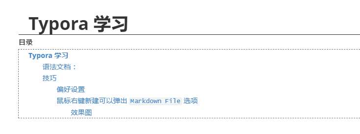
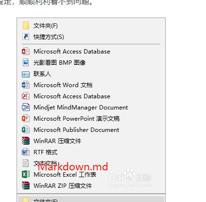

# Typora 学习

[toc]


## 语法文档 ：

- Markdown基本语法文档地址： 
  - [/other_video/easy-study-for-love/0001-typora/typora%E7%AE%80%E5%8D%95%E6%93%8D%E7%BB%83/](https://blog.notgeek.cn/other_video/easy-study-for-love/0001-typora/typora简单操练/) 
- Markdown 画图语法地址：（Markdown的画图语法不支持在 Github / Gitee 上展示）
  - [/other_video/easy-study-for-love/0001-typora/typora%E7%94%BB%E6%B5%81%E7%A8%8B%E5%9B%BE%E3%80%81%E6%97%B6%E5%BA%8F%E5%9B%BE(%E9%A1%BA%E5%BA%8F%E5%9B%BE)%E3%80%81%E7%94%98%E7%89%B9%E5%9B%BE/](/other_video/easy-study-for-love/0001-typora/typora画流程图、时序图(顺序图)、甘特图/)


> - 先对照 上边的 《typora 简单操练文档，就可以解决大多数 typora 的问题了》
>
> 你已经具备了文档编写能力了。

## 技巧

注意，typora 设置，主要在

```
- 文件
  - 偏好设置
```

### 偏好设置

#### 调节字体大小

#### 空格与换行

- 编辑时 `保留连续的空格与单个换行` 
- 导出与打印  `忽略连续的空格与单个换行` 

#### 图片插入 

- （推荐使用 `复制图片到 ./assets 文件夹` ）
  
- 没有，选择，复制到 ${} 文件夹，更改为 `/assets`
  
- 本地位置 **勾选** 

- 网络位置 **勾选**  

- 优先使用相对路径 **勾选** 

  > - 这样以后，图片容易丢失，而且一个 md 文件，对应一个 图片目录，这样子，即使删除 md 文件时，直接就可以删除对应的文件夹，
  >
  > - （微信截图可以直接，复制，粘贴可以保存在 typora 中）

### 目录

- > typora 支持目录的自动生成，
  >
  > 在文档的开始，直接输入 `[TOC]`  就好了，
  >
  > 这个语法不是 md 标准语法，github 不支持。
  >
  > 效果图：
  >
  > 

### 导入

- 如果需要导入 word 文档，pdf 等，需要安装  pandoc 

- https://www.pandoc.org/installing.html

  - 下载地址：https://github.com/jgm/pandoc/releases/latest 

    - > 下拉，请下载 pandoc-x.x.x-windows-x86_64.
      >
      > 

  - 下载安装就可以了，直接默认下一步安装（最好，选择一下安装路径，）


- 导出，直接可以用了


## 建议

- 一个 MD  文档一个文件夹，这样子导出，word ,pdf 等比较方便。


### 鼠标右键新建可以弹出 `Markdown File` 选项

#### 效果图



- 首先，新建 文本框，然后，更改后缀名 `.md` ，选择打开方式，默认为 `typora` 打开。 

- 然后，

  新建文本文件，全名称为 `右键添加新建md文件.reg`  之后，文本编辑 

  ```reg
  Windows Registry Editor Version 5.00
  [HKEY_CLASSES_ROOT\.md\ShellNew]
  "NullFile"=""
  "FileName"="template.md"
  ```

  保存，运行，确定继续，就可以了。

- 如果还不行，那么新建 `右键添加新建md文件.reg` 内容，更改为

  ```reg
  Windows Registry Editor Version 5.00
  [HKEY_CLASSES_ROOT\.md]
  @="Typora.exe"
  [HKEY_CLASSES_ROOT\.md\ShellNew]
  "NullFile"=""
  [HKEY_CLASSES_ROOT\Typora.exe]
  @="Markdown"
  ```

  保存，运行，确定，看是否可以。

## Typora Emoji

Typora Emoji

- [/other_video/easy-study-for-love/0001-typora/Typora Emoji/](/other_video/easy-study-for-love/0001-typora/Typora Emoji/)