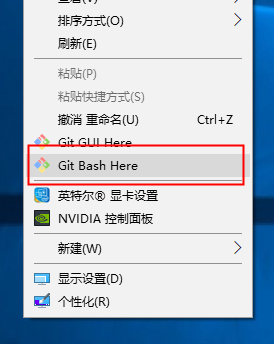
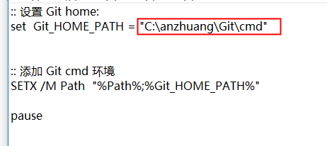
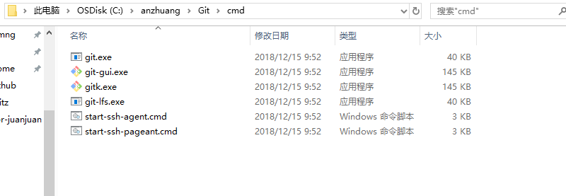
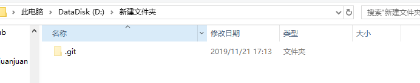

[TOC]


# git

特别简单

简单的使用教程

## 下载

https://git-scm.com/downloads 

淘宝镜像下载地址：https://npm.taobao.org/mirrors/git-for-windows/

## 安装

直接默认安装即可（如果可以勾选安装目录，请选择一个安装目录，以便于日后查找）



安装好以后，鼠标右键可以出现这个，

- 这时候，代表 git 已经安装成功了


## 傻瓜式使用

如果想要傻瓜式使用，那么需要

随便进入一个文件夹，在文件路径上输入 `cmd` 


回车。进入 cmd 文件框。

达成以下图片。

```java
D:\ku>git version
git version 2.20.1.windows.1
```


没出现不要慌

假如说，

- 出现了 `git version xxx.windows .x` 等字样，请直接进入 `初始化`

- 如果没有出现，请进行引用内的步骤


> [git version 命令不管用时，添加 git version 环境]
>
> #### 推荐
>
> 一键修改添加 git 目录到 path
>
> 该目录下有
>
> 编辑
>
> 
>
> 
>
> `C:\anzhuang\Git` 是 git 的安装目录
>
>  
>
> `C:\anzhuang\Git\cmd` 目录，如下
>
> 
>
> 
>
> #### 不推荐：
>
> 
>
> ```java
> - 此电脑
>   - 计算机
>     - 属性
>       - 高级系统设置
>         - 系统变量
> ```
>
> 系统变量里边选择 `path` 
>
> windows 10 新建，输入 `${git安装目录}\cmd`
>
> >  `C:\anzhuang\Git\cmd` 
> >
> >  - `C:\anzhuang\Git` 是我的安装目录
> >  - 那我就输入 `C:\anzhuang\Git\cmd` 就好了
>
> windows 10 以下，是一长串的化，
>
> 不小心删除一些东西，可能会造成，系统崩溃。推荐使用


## 初始化

安装完成后，还需要最后一步设置，在命令行输入：（要和你的 email 一个文件夹）

```c
$ git config --global user.name "Your Name"
$ git config --global user.email "email@example.com"
```


输入完成以后

```c
C:\windows\system32>git config user.name
darian

C:\windows\system32>git config user.email
1934849492@qq.com
```


随便找一个文件夹，作为一个 `仓库` 

就可以了

```java
D:\新建文件夹>git init
Initialized empty Git repository in D:/新建文件夹/.git/
```





这就代表已经 git 本地仓库已经建好了。


## 提交

（先看 github 新建仓库）


- 写了自动提交脚本，以及手动输入提交信息脚本


`D:\z_my_gitHub_repositories\gp-docs` 是文件夹 

```c
:: cd D:\z_my_gitHub_repositories\gp-docs

:: 加入你要自己输入 commit message
:: set /p commit_msg=Please input commit message:

:: 这条命令使用当前时间来作为 commit 的信息
set  commit_msg= %date:~0,10%   %time% AutoCommit.bat by Darian

git status 
git add * 
git commit -m "%commit_msg%"
git pull
git push
Exit
```


详细请看，非程序员不用看

https://www.liaoxuefeng.com/wiki/896043488029600/896067074338496