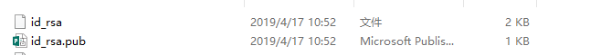
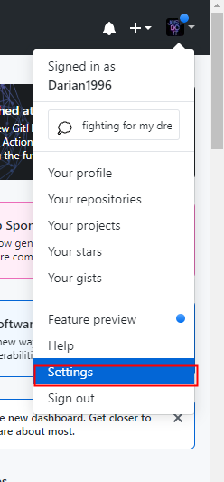
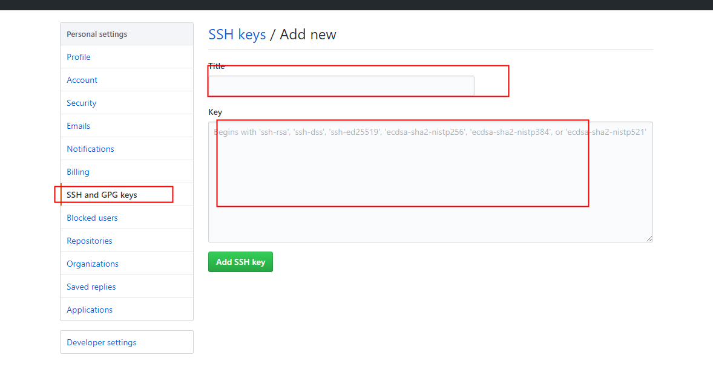
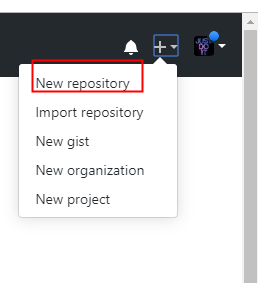
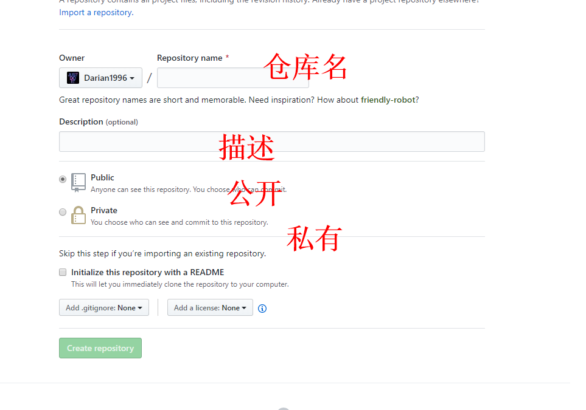
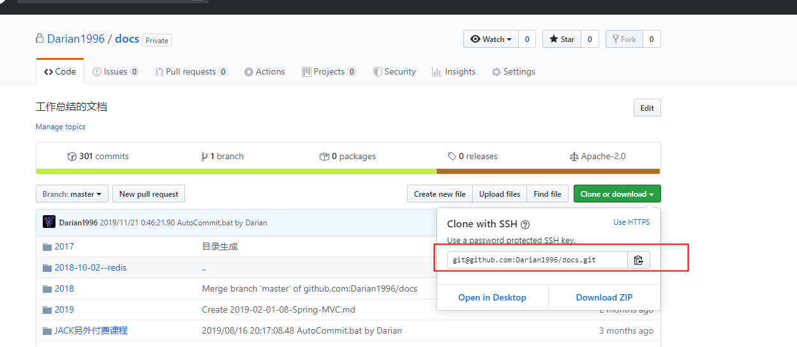

# github

## 限制

- github 不允许上传视频
- 文件不能超过 100M
- 不能管理空文件夹，只有有文件了，才可以管理，文件。


## 申请账号

- https://github.com/


## 配置密钥

SSH 秘钥默认储存在账户的主目录下的 ~/.ssh 目录

如：`C:\Users\BF100400\.ssh\` 如果，欸有，就去生成密钥，如果有，就不需要生成密钥了。

### 生成密钥

-  cmd 窗口

- ```c
  ssh-keygen -t rsa -C "your_email@youremail.com"
  ```

- 




### 配置密钥到github


{:width:="300px"}





#### 注意：

复制的是公钥。


## 创建 github 仓库







#### SSH 远端地址




### 空的仓库

```

git init
git add *
git commit -m "first commit"
git remote add origin git@github.com:Darian1996/darian-commons-utils.git
git push -u origin master
```

### 已经有仓库了，可以直接关联，提交

```
git remote add origin git@github.com:Darian1996/darian-commons-utils.git
git push -u origin master
```


## 傻瓜式提交


