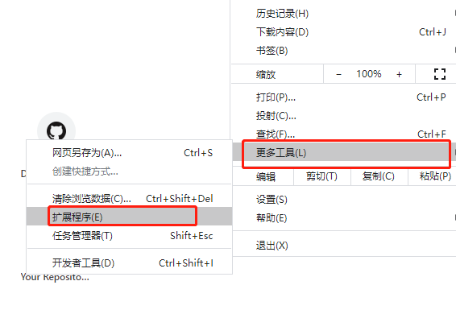
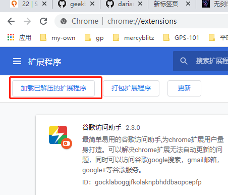

# 1. 下载

<<<<<<< HEAD
=======
谷歌助手，很多时候不用了。

>>>>>>> 198ab3d2f289bc5a93714504cab75e02cf1b0ded
zip : github 下载地址：

- https://darian.top/other_video/easy-study-for-love/0005-%E6%B7%BB%E5%8A%A0%5B%E8%B0%B7%E6%AD%8C%E4%B8%8A%E7%BD%91%E5%8A%A9%E6%89%8B%5D%E6%8F%92%E4%BB%B6/gocklaboggjfkolaknpbhddbaopcepfp.zip
- [下载链接](https://dairan.top/other_video/easy-study-for-love/0005-%E6%B7%BB%E5%8A%A0%5B%E8%B0%B7%E6%AD%8C%E4%B8%8A%E7%BD%91%E5%8A%A9%E6%89%8B%5D%E6%8F%92%E4%BB%B6/gocklaboggjfkolaknpbhddbaopcepfp.zip) 

# 2. 解压

zip 文件解压以后，可以选择

# 3. 打开谷歌浏览器扩展程序

# 4. 打开开发者模式

# 5.选择加载已解压的扩展程序

# 6. 选择，已经解压的文件

一直选择到 2.3.0 文件夹

选择，里边，以后，选择 `2.3.0` 就好了

# 7. 选择使用，至此，谷歌访问助手安装成功

